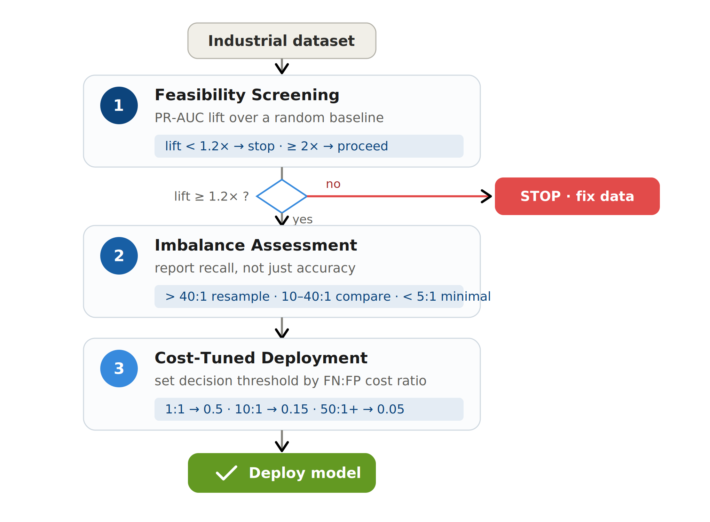

# FACT: A Feasibility-Aware, Cost-Tuned Framework for Predictive Maintenance

A cross-industry empirical study of machine learning for predictive maintenance across six industrial datasets, with external validation on six further datasets across four additional industries, and a practical three-stage decision framework for deciding whether and how to deploy predictive maintenance.

## Motivation

Most predictive maintenance studies report a single accuracy figure on one or two datasets and conclude that a given algorithm works well. This project takes a different view. Across six industrial datasets it shows that:

1. **Headline accuracy hides poor failure detection.** One dataset reached 98% accuracy while detecting under 1% of actual failures.
2. **No imbalance strategy is universally best.** The value of resampling scales with difficulty: on easy/moderate data the baseline matches or beats SMOTE, while on hard, severely imbalanced data resampling is essential.
3. **Some datasets cannot support predictive maintenance at all.** This is detectable before modelling investment using a feasibility screen.

## The FACT Framework

A three-stage decision process applied before deploying a predictive maintenance model:

| Stage | Question | Method | Decision rule |
|-------|----------|--------|---------------|
| 1. Feasibility Screening | Can the data support PM at all? | PR-AUC lift over random | >2x proceed; 1.2-2x caution; <1.2x stop, fix data |
| 2. Imbalance Assessment | Is accuracy hiding poor detection? | Imbalance ratio; report recall | >40:1 resampling/threshold essential; 10-40:1 compare; <5:1 minimal |
| 3. Cost-Tuned Deployment | What threshold fits the business? | Threshold by FN:FP cost ratio | 1:1 -> 0.5; 10:1 -> 0.15; 50:1+ -> 0.05 |

## External Validation

FACT's first two steps were validated on six further datasets across four new industries (aerospace, rotating machinery, water infrastructure, semiconductor) that were **not** used to develop it, plus two controlled experiments:

- **Feasibility screen** correctly flagged every learnable dataset; a label-permutation control confirms the lift collapses to ~1.0 when signal is destroyed (CNC 23.3x to 1.07x).
- **Imbalance assessment** confirmed in both directions on independent data: baseline >= SMOTE on easy/moderate data (C-MAPSS, p=0.003), while on the hard SECOM semiconductor dataset the baseline detected zero failures and resampling was essential (p=0.004).
- **Model-family robustness:** the same patterns hold for a neural network, not just tree ensembles.
- **Cost-tuned thresholds** yield measurable savings vs the default (46% at a 10:1 cost ratio).

See `validation/README.md` for the full table and `src/validation_experiments.py` for reproducible code.

## Repository Structure
